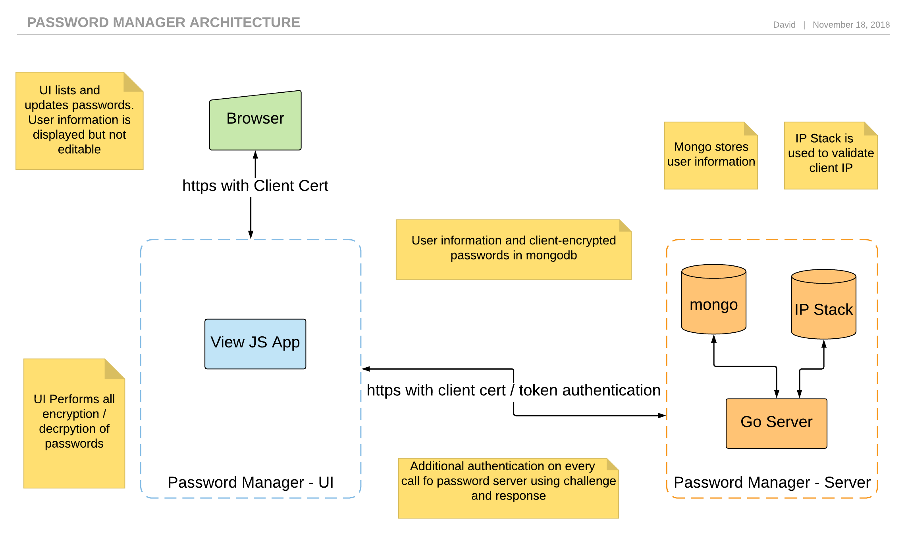

# Password Service

[](https://codeclimate.com/github/dgoldstein1/passwordservice/maintainability)

[](https://codeclimate.com/github/dgoldstein1/passwordservice/test_coverage)

[](https://circleci.com/gh/dgoldstein1/passwordservice)

go server for safely storing and managing encrypted passwords

### Architecture



### Features

- geo-locating and IP tracking to prevent unknown logins
- challenge and reponse weak authentication to prevent [person in the midle attacks](https://en.wikipedia.org/wiki/Challenge%E2%80%93response_authentication#Examples)
- strong end to end encryption

Also facilitates:

- management and storage of user information
- users to see when / where their passwords have been accessed from


# Development

### Requirements

The following software must be installed before loading up the project.

- [go](https://golang.org/doc/install). Please also [setup GOBIN and GOPATH](https://github.com/golang/go/wiki/SettingGOPATH)
- [fabric](https://github.com/DecipherNow/gm-fabric-go#installation)
- [docker cli](https://docs.docker.com/install)
- [node](https://nodejs.org/en/download/)
- [aglio](https://github.com/danielgtaylor/aglio)

Currently the following operating systems are tested and supported

- OS X 10.13 High Sierra
- Ubuntu 18
- Pop!OS 17

### Setting up the Project

Clone project

```sh
# create project path
mkdir -p ${GOPATH}/src/github.com/dgoldstein1
cd ${GOPATH}/src/github.com/dgoldstein1
# clone using ssh. Make sure you've added your public key to gitlab
git clone git@github.com:dgoldstein1/passwordservice.git
```

#### Launch the Project

- Generate server certs and certificate authorities. By default server certs are in `docker/passwordservice/certs`. 
- You will need to generate client a p12 client cert. This should be added to the brower or used when testing with curl.

```sh
# build docker image
./build_docker_image.sh
# start docker
docker-compose up -d
# see if all containers are up
docker-compose ps
```

### Developemnt

Any changes made in the `./cmd/server` directors are automatically applied to the running container and the service is restarted. If you need to change packages outside this directory (e.g. protobuf, docs, vendor), the following can be done:

```sh
# generate execuatbe artifact to $GOPATH/bin
./build_server.sh
# generate new protobuf definitions for entire app
./generate_proto.sh
# create rpm
./rpm/build.sh
# regenerate documentation from api blueprint files
./create_documentation.sh
```

### Deployment

Develop and Master are automatically deployed on merge.

# Testing

```sh
cd ./cmd/server/methods/
go test -v -cover -covermode=count -coverprofile=coverage.out
```

## Authors

* **David Goldstein** - [DavidCharlesGoldstein.com](http://www.davidcharlesgoldstein.com/?github-password-service) - [Decipher Technology Studios](http://deciphernow.com/)

## License

This project is licensed under the GLP License - see the [LICENSE.md](LICENSE.md) file for details
